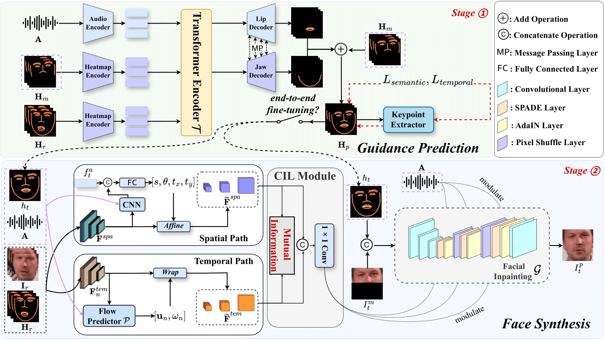

# STSA: Spatial-Temporal Semantic Alignment for Facial Visual Dubbing
<div align="center" style="font-family: charter;">

Pytorch implementation for our ICME2025 submission "STSA: **S**patial-**T**emporal **S**emantic **A**lignment for Facial Visual Dubbing".
<a href='https://arxiv.org/abs/2503.23039'></a> <a href='https://github.com/user-attachments/files/19774563/supp.pdf'></a> [](https://www.youtube.com/watch?v=vwtcteFYp64)



</div>

## Todo:
- [x] inference code
- [x] paper & supplementary material
- [x] youtube demo 
- [ ] training code
- [ ] fine-tuning code 


## Demo:
### Multilingual Generation
<table class="center">
<tr>
    <td width=50% style="border: none">
        <video controls loop src="https://github.com/user-attachments/assets/4e52356a-ed42-40ef-9ea3-5ffca7bbd3d1" muted="false"></video>
    </td>
    <td width=50% style="border: none">
        <video controls loop src="https://github.com/user-attachments/assets/e71cce15-0a18-45e5-b253-52c5e9fc4064" muted="false"></video>
    </td>
</tr>
<tr>
    <td width=50% style="border: none">
        <video controls loop src="https://github.com/user-attachments/assets/3880dc0d-aa2c-4ba7-8793-a29ab33dd129" muted="false"></video>
    </td>
    <td width=50% style="border: none">
        <video controls loop src="https://github.com/user-attachments/assets/3fc89023-1b10-4902-a950-130c359ac81e" muted="false"></video>
    </td>
</tr>

</table>


### Long Video Generation Compared with SOTA Methods
We compare our method with DiffTalk(CVPR23'), DINet(AAAI23'), IP-LAP(CVPR23'), MuseTalk(Arxiv2024), PC-AVS(CVPR21'), TalkLip(CVPR23'), Wav2Lip(MM'20)

<table class="center">
<tr>
    <td width=25% style="border: none">
        <video controls loop src="https://github.com/user-attachments/assets/b6e9b594-4e7a-41f3-ad8e-1998caa12b3b" muted="false"></video>
    </td>
    <td width=25% style="border: none">
        <video controls loop src="https://github.com/user-attachments/assets/297fcb43-00f4-4d81-a022-70f07867ce03" muted="false"></video>
    </td>
    <td width=25% style="border: none">
        <video controls loop src="https://github.com/user-attachments/assets/10b7ea15-0d01-4bcd-a036-fbe58b8bda33" muted="false"></video>
    </td>
    <td width=25% style="border: none">
        <video controls loop src="https://github.com/user-attachments/assets/55466ea9-2d30-42cc-8ed8-ffe8878f2eb7" muted="false"></video>
    </td>
</tr>
<tr>
    <td width=25% style="border: none">
        <video controls loop src="https://github.com/user-attachments/assets/4233c7cb-8eb4-4977-8239-3c39055fc27f" muted="false"></video>
    </td>
    <td width=25% style="border: none">
        <video controls loop src="https://github.com/user-attachments/assets/ca5e0b92-249a-4fe1-bf53-85d21e09e059" muted="false"></video>
    </td>
    <td width=25% style="border: none">
        <video controls loop src="https://github.com/user-attachments/assets/e5e3d6ac-75dd-443f-af79-c60b94c7062c" muted="false"></video>
    </td>
    <td width=25% style="border: none">
        <video controls loop src="https://github.com/user-attachments/assets/0fe501d0-1c83-48c6-8998-6958377e9d4e" muted="false"></video>
    </td>
</tr>

</table>


## Inference:
### Requirements
- Python 3.8.7
- torch 1.12.1
- torchvision 0.13.1
- librosa 0.9.2
- ffmpeg

### Prepare Environment
First create conda environment:
```
conda create -n stsa python=3.8
conda activate stsa
```
[Pytorch](https://pytorch.org/)  1.12.1 is used, other requirements are listed in "requirements.txt". Please run:
```
pip install -r requirements.txt
```
### Quick Start
Download the [pretrained weights](https://www.jianguoyun.com/p/DW9UAjMQqcOQDRiotuMFIAA), and put the weights under ./checkpoints 
After this, run the following command:
```
python inference.py --video_path "demo_templates/video/speakerine.mp4" --audio_path "demo_templates/audio/education.wav"
```
You can specify the `--video_path` and `--audio_path` option to inference other videos.
